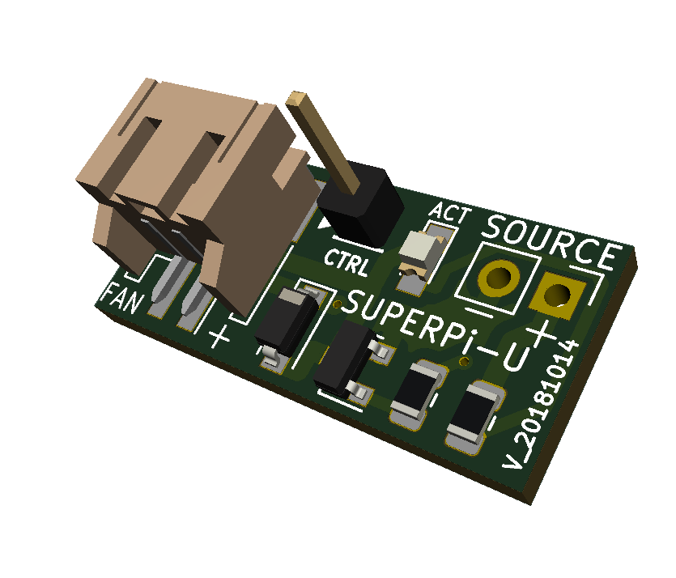
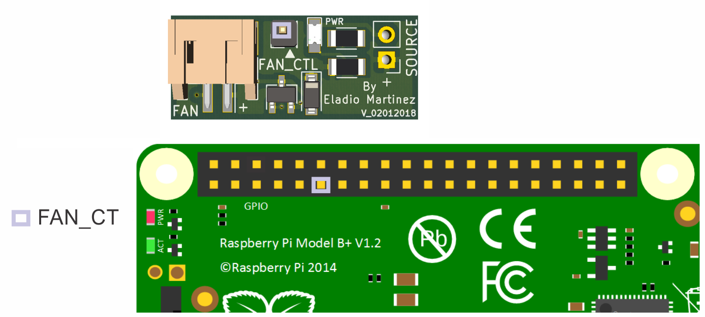

NESPi Fan Control Board
===============================
This is a temperature control board for the RetroFlag NESPi Case and the YIKESHU Black NES Case, this PCB add the ability to cooldown your system during game play.

License
-------
<div align="center"><a rel="license" href="https://creativecommons.org/licenses/by-nc-sa/4.0/"></a><br /></div>

This project is licensed under the Attribution-NonCommercial-ShareAlike CC BY-NC-SA 4.0 license. The full legal text of the license may be found in the LICENSE.txt file in this repository. For more information about this license, please visit 
the Creative Commons Foundation (https://creativecommons.org/licenses/by-nc-sa/4.0/).

Features
--------

* Small footprint

* Easy Temperature Control

* 2 wire fan control

* Minimal hardware modification

* One-line script installation

* Compatible with RetroFlag SNESPi Case U/J, MEGAPi Case, NESPi Case/NESPi Case + and the YIKESHU Black NES Case

* You can buy the latest version of this board fully assembled from [http://mini-mods.com](http://mini-mods.com/product/retroflag-basic-fan-control/)

----------
* Fan Control Compatible with: MEGAPi Case, NESPi Case/NESPi Case + and the YIKESHU Black NES Case.


* Fan Control Compatible with: SNESPi Case U and SNESPi Case J.


----------

Prerequisites
---------------------

1. RetroPie

      To install Retropie you may download the image for [Raspberry Pi 3](https://github.com/RetroPie/RetroPie-Setup/releases/download/4.2/retropie-4.2-rpi2_rpi3.img.gz "RetroPie for version RPi 2/3") and follow installation instruction at the [retropie website](https://retropie.org.uk/docs/First-Installation/#installation "RetroPie installation instructions").

2. Internet connection

      Internet access via Ethernet or to set up your internet via WiFi, you can follow the instructions [here](https://retropie.org.uk/docs/Wifi/ "RetroPie WiFi Setup").

3. Keyboard and screen, or any computer/laptop (via SSH)

      To access your Pi via SSH, you can also follow this instructions [here](https://retropie.org.uk/docs/SSH/ "Raspberry Pi SSH Setup").

4. Basic soldering skills

      This PCB need to be solder directly into the built-in fan connector.
	  
Hardware Installation
---------------------
It's very important to follow the right pin configuration to prevent damage to your Pi.

  * `FAN_CT Pin` - Connect to GPIO 17 (RPI pin 11)
  * `SOURCE Pin` - Connect to the built-in fan connector (follow polarity markings)
  


Software Installation
---------------------

**NOTE**: This assumes that you have already connected the jumper wires to the correct PINS and ports;
If you haven't, see the [Hardware Installation](#hardware-installation) section.

This instructions are a *step-by-step guide* to install necessary software for your **NESPi Fan Control Board**.
You can setup this via SSH or using the command line interface in your RetroPie. To enter the command line interface of RetroPie, *PRESS* ***F4*** just after booting up.

----------

Open your terminal and type the one-line installation command below:
```bash
$ wget -O - "https://github.com/mafe72/NESPi-Fan-Control-Board/raw/master/install.sh" | sudo bash
```

The script will automatically install pertinent files and configure your Raspberry Pi to enable **NESPi Fan Control Board.**
Installation will automatically reboot once all processes is completed.

After rebooting, your **NESPi Fan Control Board** is now fully functional.

Software Uninstall
---------------------

This instructions are a *step-by-step guide* to uninstall necessary software for your **NESPi Fan Control Board**.
You can setup this via SSH or using the command line interface in your RetroPie. To enter the command line interface of RetroPie, *PRESS* ***F4*** just after booting up.

----------

Open your terminal and type the one-line installation command below:
```bash
$ wget -O - "https://github.com/mafe72/NESPi-Fan-Control-Board/raw/master/uninstall.sh" | sudo bash
```

The script will automatically uninstall all configuration files from your Raspberry Pi to disable the **NESPi Fan Control Board.**
The uninstall script will automatically reboot once all processes are completed.

After rebooting, your **NESPi Fan Control Board** will be fully deactivated.

----------
	
Basic Usage
-----------

* FAN ON
			
		Fan will turn ON when temperature exceeded 55C
		
* FAN OFF
		
		Fan will turn OFF when temperature under 40C
